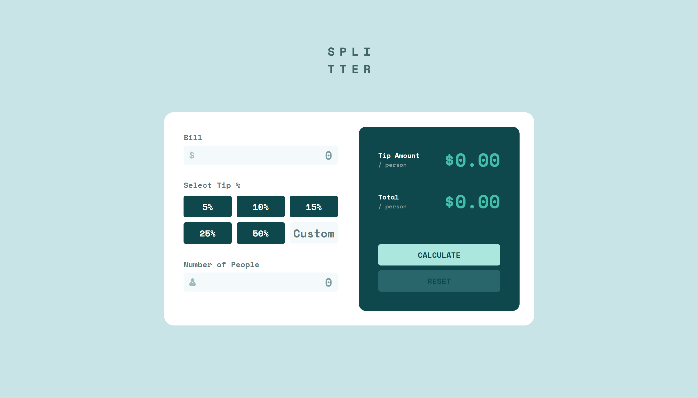

# Frontend Mentor - Tip calculator app solution

This is a solution to the [Tip calculator app challenge on Frontend Mentor](https://www.frontendmentor.io/challenges/tip-calculator-app-ugJNGbJUX). Frontend Mentor challenges help you improve your coding skills by building realistic projects.

## Table of contents

- [Overview](#overview)
  - [The challenge](#the-challenge)
  - [Screenshot](#screenshot)
  - [Links](#links)
- [My process](#my-process)
  - [Built with](#built-with)
  - [What I learned](#what-i-learned)
  - [Continued development](#continued-development)
  - [Useful resources](#useful-resources)
- [Author](#author)
- [Acknowledgments](#acknowledgments)

**Note: Delete this note and update the table of contents based on what sections you keep.**

## Overview

### The challenge

Users should be able to:

- View the optimal layout for the app depending on their device's screen size
- See hover states for all interactive elements on the page
- Calculate the correct tip and total cost of the bill per person

### Screenshot





## My process

### Built with

- HTML
- CSS
- JS

### What I learned

One of the biggest things that I learnt in this project is how to refactor code. Starting with a ton amount of lines and then slowly optimizing it to reduce the lines significantly. Most of this was done with help from others, but from observing how they do it I was able to refactor some JavaScript myself which looks like this:

```JS
const lightUp = function (input) {
    input.addEventListener("input", function () {
        if (input.value !== "") {
            calculate.classList.remove("mainButtonStyle")
            reset.classList.remove("mainButtonStyle");
            calculate.classList.add("buttonHoverStyle");
            reset.classList.add("buttonHoverStyle");
        } else {
            calculate.classList.add("mainButtonStyle")
            reset.classList.add("mainButtonStyle");
            calculate.classList.remove("buttonHoverStyle");
            reset.classList.remove("buttonHoverStyle");
        }
    })
}

lightUp(billValue)
lightUp(customTip)
lightUp(peopleAmount)
```

Also learning how to use arrays and for loops to manipulate the website was really cool. This is one of the simpler ones but it's one I did by myself: 
```JS
const values = [customTip, billValue, peopleAmount]
    for (const value of values) {
        value.value = "";
    }
```

For CSS, the most satisfying thing that I did was with the button hovering. While quite simple, it looks very visually appealing on the site.
```CSS
.fivePercentButton:hover,
.tenPercentButton:hover,
.fifteenPercentButton:hover,
.twentyfivePercentButton:hover,
.fiftyPercentButton:hover {
    background-color: var(--green-400);
    color: var(--green-900);
    transition: 0.2s;
}
```

### Continued development

The main thing that I want to take away from this project is primarily the refactoring part, as that was really useful in making my code more readable. This will help me for future projects where I might be stuck with a bunch of repetitive lines of code, I can look back and see how to trim the file down to as little lines as possible. 

### Useful resources

I was pretty competent with the HTML and CSS of this project and for the JavaScript I mainly asked my teacher for help, so I didn't really use many websites for this project. However, the most useful thing that I searched up was a StackOverflow question on number inputs.
- [StackOverflow](https://stackoverflow.com/questions/3790935/can-i-hide-the-html5-number-input-s-spin-box) - This StackOverflow question was very useful, as the arrows that appear with a number input didn't look good and it wasn't part of the design anyway, so this helped me figure out how to hide the arrows, making the box much cleaner

## Author

- Frontend Mentor - [@fichbickit](https://www.frontendmentor.io/profile/fichbickit)
- GitHub - [@fichbickit](https://www.github.com/fichbickit)

## Acknowledgments

My classmate Gabe told me to use the css property 'outline' to get rid of the natural border that appears when you click on an input, thus allowing the use of the green border on focus and the red one on error

My teacher Mr Del Rosario was a massive help this project, and I came across lots of small, unexplainable bugs that I would have never figured out if he didn't have the experience to know what was going wrong. Huge thanks for all the time that he helped me with this, expecially when refactoring. When I had the project complete I had around 350 lines of JavaScript, but with his help I got it down to just under 150. His GitHub and Frontend Mentor are linked below

- GitHub - [@delroscol98](https://www.github.com/delroscol98)
- Frontend Mentor - [@delroscol98](https://www.frontendmentor.io/profile/delroscol98)